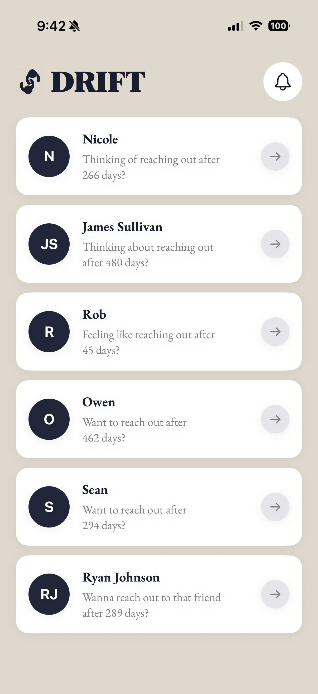
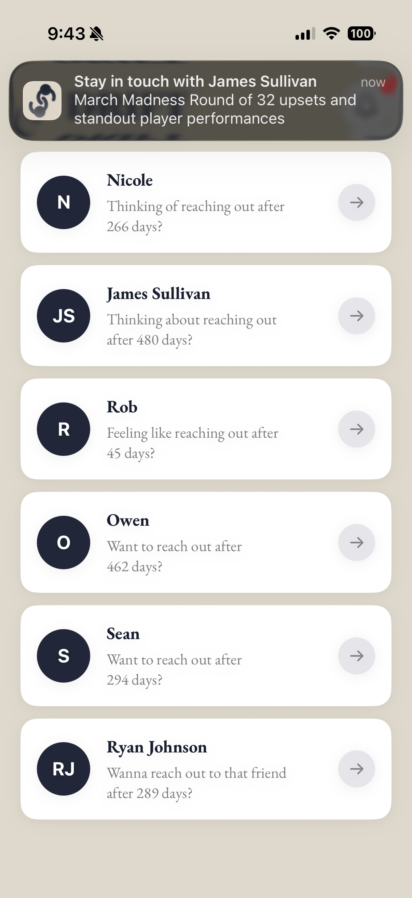
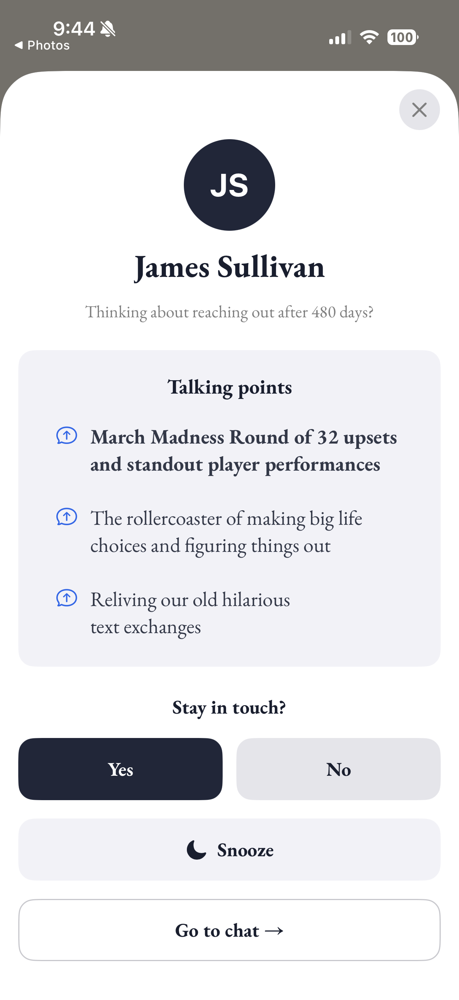
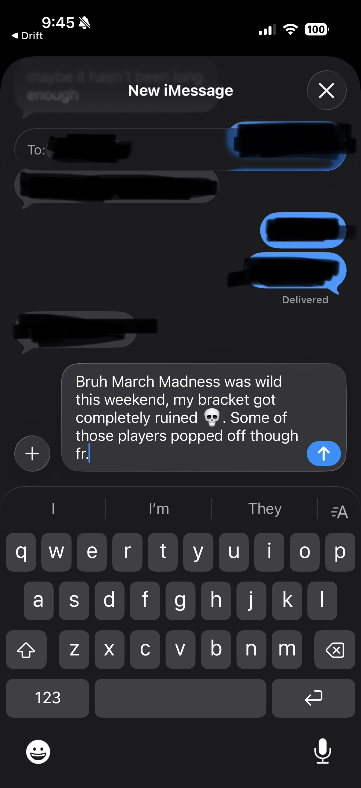

# Drift

Drift notices when you've stopped texting people you used to be close with, and nudges you to reach back out — with real things to talk about.

## How it works

1. **Mac script** reads your iMessage history from `~/Library/Messages/chat.db`
2. **Filters** candidates: must have 50+ messages exchanged, silent for 30–1500 days, saved in your contacts
3. **Gemini** reads the last 100 messages per candidate and decides if the relationship is worth rekindling
4. **Gemini** generates 3 talking points per contact (one current/news-based, one inferred from the conversation, one shared experience idea) + a ready-to-send message for each, written in your own tone
5. **Firestore** syncs the results to your iPhone in real time
6. **iOS app** shows nudge cards with talking points, lets you keep or dismiss them, and sends push notifications

## Stack

- **Backend**: Python 3, Google Gemini 2.5 Flash (with Search grounding), Firebase Firestore
- **Frontend**: SwiftUI, Firebase iOS SDK

## Setup

### Backend

```bash
cd backend/
python3 -m venv venv && source venv/bin/activate
pip install google-genai firebase-admin python-dotenv
```

Create `backend/.env`:
```
GEMINI_API_KEY=your_key_here
```

Add `backend/serviceAccountKey.json` (Firebase service account from the Firebase console).

Grant Terminal **Full Disk Access** in System Settings → Privacy & Security (required to read `chat.db`).

Run:
```bash
python3 main.py
```

### iOS

Open `frontend/` in Xcode, add your `GoogleService-Info.plist`, and run on a device or simulator.

## Screenshots

| | | | | |
|---|---|---|---|---|
|  |  |  |  |  |
| **Home** — ranked nudge cards with AI-generated subtitles | **Notification** — live banner with a talking point | **Notifications sheet** — recent and snoozed nudges | **Detail** — talking points and quick actions | **iMessage** — conversation starter pre-filled and ready to send |

## Requirements

- macOS with iMessage history
- Python 3.10+
- Xcode 15+
- A Firebase project with Firestore enabled
- Gemini API key
